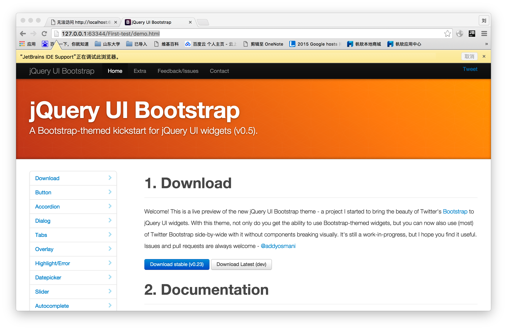

# 使用Chrome进行JS调试

1. clone好本项目之后,按照如下配置js debug,特别说明的是一定要使用chrome,不能使用自带的IE或者Safari

2. 点击debug之后会提示,如果没有安装jetbrains IDE support,ide会自动提示需要安装,点击链接之后就会跳转到chrome插件安装页面

3. 安装之后,再次点击debug,就会成功运行调试

**注意:**

有的时候在配置好的情况下,也不能调试运行,回到WebStorm调试界面,会提示没有安装jetbrains IDE support,但是明明安装过了.这时就要仔细看看提示下面的一个端口号,记住这个号码,然后到chrome中,按照下面的步骤更改端口号,就可以了.

